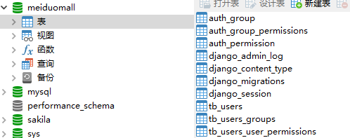
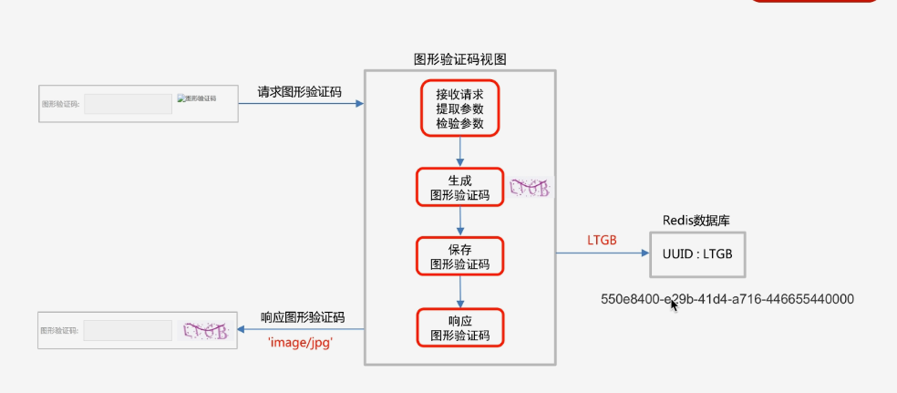
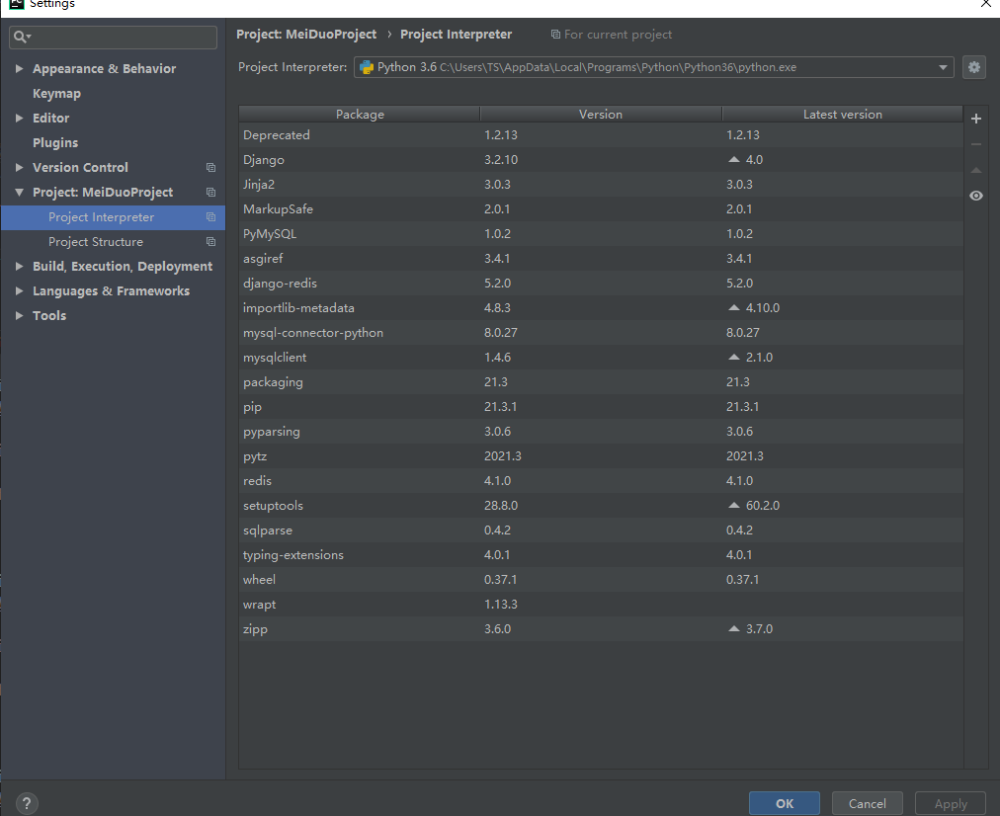

## MeiDuoProject

#### 介绍
python项目：美多商城，仅仅用于个人的学习，记录学习利用django开发项目的过程等

#### 环境说明

软件列表

```
Package                Version
---------------------- -------
asgiref                3.4.1
Deprecated             1.2.13
Django                 3.2.10
django-redis           5.2.0
importlib-metadata     4.8.3
Jinja2                 3.0.3
MarkupSafe             2.0.1
mysql-connector-python 8.0.27
mysqlclient            1.4.6
packaging              21.3
pip                    21.3.1
PyMySQL                1.0.2
pyparsing              3.0.6
pytz                   2021.3
redis                  4.1.0
setuptools             28.8.0
sqlparse               0.4.2
typing_extensions      4.0.1
wheel                  0.37.1
wrapt                  1.13.3
zipp                   3.6.0
```

安装软件

```关于安装
pip install django==3.2.10
# 其他可以根据也可以设定指定版本
pip install Jinja2
pip install pymysql
pip insatll django-redis

下载并安装mysql8.x
```

注意事项：

django3.x版本不支持mysql5.x,所以我使用的版本为mysql8.x

#### 常用的命令

```
#创建一个项目
python django-admin startproject MeiDuoProject
#启动项目
python manage.py runserver
# 创建子应用
python manage.py startapp users
# 创建迁移文件
python manage.py makemigrations
# 执行迁移命令
python manage.py migrate
```

#### 开发日志

##### 2021/12/28-2022/1/1：

##### 2022/1/1: 

1、mysql8.x的安装包放在doc/soft文件夹下


2、安装为mysql8.x之后，执行python manage.py migrate没有出错，执行产生的效果图如下：



##### 2022/1/2:

1、刷新浏览器两种方式：

* f5刷新：部分加载数据
* shift+f5 刷新：会重新加载所有数据

2、关于如何获取到post请求的内容：

* 先通过print方法打印request.Post中的内容进行查看相关内容
* 通过value = request.Post.get('key')形式获取相应的字段

3、关于正则表达式

* 引入正则表达式模块：import re
* re.match(r'^[a-zA-Z0-9]{5,50}$')的形式

##### 2022/1/4:

1、解决之前因为正则表达式写的不规范导致错误，我将{5,20}写成了{5-20}导致正则匹配错误

2、利用axios向服务端发送get请求判断用户名是否存在

```javascript
 //axios.get('url','请求头').then().catch()
                let url = '/usernames/'+this.username+'/count/';
                axios.get(url,{
                    responseType:'json'
                })
                .then(resp =>{
                    if(resp.data.count ==1){
                        this.error_name_message = '用户名已存在';
                        this.error_name = true;
                    }else{
                        this.error_name = false;
                    }
                })
                .catch(error=>{
                    this.error_name_message = '未知错误或者响应';
                    this.error_name = true;
                })
```

3、验证码逻辑分析



#### 问题日志

由于过程中经常遇到各种奇葩问题，所以特此记录。

```
关于gitee上限制大文件：
问题：
由于我要把mysql的安装包上传到gitee上，所以我在本地提交了安装包，但是推送到远端，即gitee上时候，由于文件太大无法推送。
解决方法：
想要再次推送删除掉此安装包(大文件)，从远端克隆一份代码(newcode)，将之前那份代码(oldcode)的除去.git文件夹全部文件到从远端克隆的文件夹(newcode)中,替换相应内容，再提交即可。
```

```
关于正则使用错误：
url(r'^usernames/(?P<username>[a-zA-Z0-9_-]{5-20})/count/$',views.UsernameCountView.as_view())

    url(r'^usernames/(?P<username>[a-zA-Z0-9_-]{5,20})/count/$',views.UsernameCountView.as_view()),

由于我将{5,20}写成了{5-20}导致正则表达式一直匹配不上
```


#### 一些发现

pycharm会在此处显示你所有安装的软件包，和所用的python解释器的版本信息



