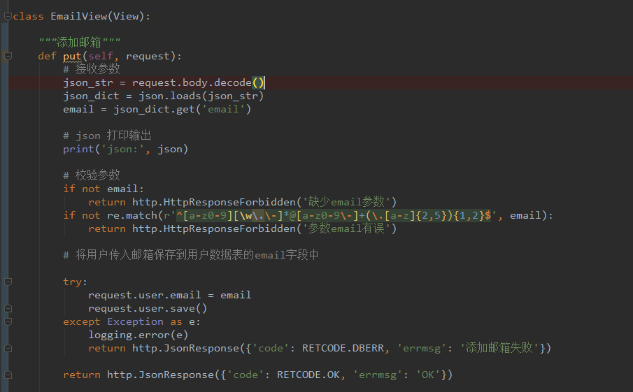
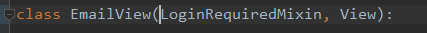
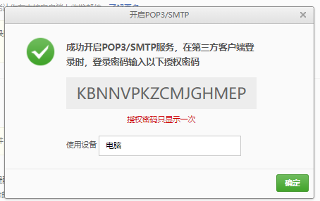

# MeiDuoProject

## 介绍

python项目：美多商城，仅仅用于个人的学习，记录学习利用django开发项目的过程等

### Tips：

* 回退本地版本并推送到远端：

  ```shell
  # 回退一个版本
  git reset head~
  # 强制推送到远端
  git push -f
  ```

## 环境说明

### 软件列表

```
Package                Version
---------------------- -------
asgiref                3.4.1
Deprecated             1.2.13
Django                 3.2.10
django-redis           5.2.0
importlib-metadata     4.8.3
Jinja2                 3.0.3
MarkupSafe             2.0.1
mysql-connector-python 8.0.27
mysqlclient            1.4.6
packaging              21.3
pip                    21.3.1
PyMySQL                1.0.2
pyparsing              3.0.6
pytz                   2021.3
redis                  4.1.0
setuptools             28.8.0
sqlparse               0.4.2
typing_extensions      4.0.1
wheel                  0.37.1
wrapt                  1.13.3
zipp                   3.6.0
```

### 安装软件

```关于安装
pip install django==3.2.10
# 其他可以根据也可以设定指定版本
pip install Jinja2
pip install pymysql
pip insatll django-redis

下载并安装mysql8.x
```

注意事项：

django3.x版本不支持mysql5.x,所以我使用的版本为mysql8.x

### 常用的命令

```
#创建一个项目
python django-admin startproject MeiDuoProject
#启动项目
python manage.py runserver
# 创建子应用
python manage.py startapp users
# 创建迁移文件
python manage.py makemigrations
# 执行迁移命令
python manage.py migrate
```

## 开发日志

### 2022/1/1: 安装mysql8.x

1、mysql8.x的安装包放在doc/soft文件夹下


2、安装为mysql8.x之后，执行python manage.py migrate没有出错，执行产生的效果图如下：


### 2022/1/2:刷新浏览器的方式，查看post请求的内容，简单的正则表达式的使用

#### 1、刷新浏览器两种方式：

* f5刷新：部分加载数据
* shift+f5 刷新：会重新加载所有数据

#### 2、关于如何获取到post请求的内容：

* 先通过print方法打印request.Post中的内容进行查看相关内容
* 通过value = request.Post.get('key')形式获取相应的字段

#### 3、关于正则表达式

* 引入正则表达式模块：import re
* re.match(r'^[a-zA-Z0-9]{5,50}$')的形式

### 2022/1/4:记录正则表达式的错误书写、利用axios向服务端发送get请求(捕获异常、处理函数回调)、图形验证码的使用

#### 1、解决之前因为正则表达式写的不规范导致错误，我将{5,20}写成了{5-20}导致正则匹配错误

#### 2、利用axios向服务端发送get请求判断用户名是否存在

```javascript
 //axios.get('url','请求头').then().catch()
let url = '/usernames/'+this.username+'/count/';
axios.get(url,{
    responseType:'json'
})
    .then(resp =>{
    if(resp.data.count ==1){
        this.error_name_message = '用户名已存在';
        this.error_name = true;
    }else{
        this.error_name = false;
    }
})
    .catch(error=>{
    this.error_name_message = '未知错误或者响应';
    this.error_name = true;
})
```

#### 3、验证码逻辑分析


* 准备captcha扩展包，用于存储图形验证码

  

* 准备redis数据库，存储图形验证码：redis 2号库，在setting文件夹下的dev.py添加redis设置信息

  ```python
  # 配置redis数据库 https://django-redis-chs.readthedocs.io/zh_CN/latest/
  CACHES = {
      # 默认
      "default": {
          "BACKEND": "django_redis.cache.RedisCache",
          "LOCATION": "redis://127.0.0.1:6379/0",
          "OPTIONS": {
              "CLIENT_CLASS": "django_redis.client.DefaultClient",
          }
      },
      # session
      "session": {
          "BACKEND": "django_redis.cache.RedisCache",
          "LOCATION": "redis://127.0.0.1:6379/1",
          "OPTIONS": {
              "CLIENT_CLASS": "django_redis.client.DefaultClient",
          }
      },
      # virify_code
      "virify_code":{
          # 验证码
          "BACKEND": "django_redis.cache.RedisCache",
          "LOCATION": "redis://127.0.0.1:6379/2",
          "OPTIONS": {
              "CLIENT_CLASS": "django_redis.client.DefaultClient",
          }
      },
  }
  ```

* 图形验证码后端逻辑实现

  1、创建子应用验证码:verifications

  2、在工程文件夹下的urls.py文件中设置路由信息

  ```python
   url(r'',include(('verifications.urls','verifications'),namespace='verifications')),
  ```

  在app/verifications文件下新建urls.py文件，设置验证码的路由信息

  ```
  from django.conf.urls import url
  from . import  views
  
  urlpatterns = [
      url(r'^image_codes/(?P<uuid>[\w-]+)/$',views.ImageCodeView.as_view())
  ]
  ```

  在app/verifications文件夹下的models.py创建ImageCodeView的视图：

  ```python
  from django.views import View
  class ImageCodeView(View):
      pass
  ```

### 2022/1/5:图形验证码的后端逻辑和前端逻辑的具体实现，

后端简单逻辑：将captcha文件夹放入到app/verifications/libs文件夹下,利用captcha生成验证码的图像，利用redis存储创建的图形验证码，设置超时时间

```python
from django.views import View

from django_redis import get_redis_connection
from django import http
from verifications.libs.captcha.captcha import captcha

# 在此处创建你的视图
class ImageCodeView(View):
    def get(self,request,uuid):
        # 接收和校验参数
        # 生成图形验证码
        text,image = captcha.generate_captcha()
        print('text:',text,'image:',image)
        # 保存图形验证码
        redis_conn = get_redis_connection('virify_code')
        #redis_conn.setex('key','expires','value')
        redis_conn.setex('img_%s'%uuid,300,text)

        return http.HttpResponse(image,content_type='image/jepg')
```

前端简单逻辑：register.html中，引入common.js，用来调用生成uuid的相关函数；绑定变量image_code_url 和设置点击图片切换函数generate_image_code


register.js中,绑定变量


生成uuid，


### 2022/1/7:首页跳转登录界面和登录相关逻辑验证

* 首页跳转到注册页面

* 点击登录按钮后，首页跳转到登录页面，登录之后跳转到首页
* 登录相关逻辑验证

### 2022/1/8:跳转到用户中心

* 实现了点击用户中心，并跳转到用户中心的功能，如果没有登录则跳转到登录页面，登录成功后再跳转回来
* 关于封装自定义登录类等等

### 2022/1/27:验证邮箱功能实现

#### 用户模型类补充email_active字段

1、添加邮箱验证的状态email_active


2、执行如下操作更新表字段

```python
# 创建迁移文件
python manage.py makemigrations
# 执行迁移命令
python manage.py migrate
```

3、产生的结果


#### 查询并渲染用户基本信息

1、在UserInfoView中处理get请求，设置context数据：包括用户名，手机号，邮箱，邮箱激活状态


2、页面上接收这些数据，并设置到绑定到vue的对象中


3、展示用户的信息等


#### 修改用户绑定的邮箱:接口的定义

#####  1、crf认证

```
"x-csrftoken":getcookie('x-csrftoken')
```

##### 2、接口设计和定义

###### 在users子应用下的views.py中定义EmailView类，定义put接口


###### 在user子应用下的urls.py中定义范文的路由关系


### 2022/1/28:邮箱校验

#### 1、采用put命令，因为是修改上条数据

#### 2 接收参数、校验参数、处理数据（保存到数据库或者丢弃）



#### 3、修改登录邮箱需要验证用户是否登录，继承LoginRequiredMixin



#### 4、邮箱授权码



#### 4 总结

##### 4.1 使用json库，必须引入json库

```python
import json
```

##### 4.2 request.body获取到的是字节数据，需要使用decode转化为jsonstr

##### 4.3 保存数据

```
user.email = email
user.save()
```

### 2022/6/5 用户详情页，用户浏览记录 设计浏览记录的存储方案

Redis对于每个用户维护一条浏览记录，一个list对应一个用户的浏览记录，只有登录的用户才需要保存用户的浏览记录

>history_user_id1 2 8 5
>
>history_user_id2 3 6 9
>
>history_user_id3 1 7 4 3 6

#### 1、存储数据说明

虽然记录浏览界面上要展示商品的一些sku信息，但是我们在存储时候没有必要存很多的SKU信息，我们选择存储sku信息的编号（sku_id）来表示该件商品的浏览记录，存储数据为sku_id

#### 2、存储位置说明

用户浏览记录是临时数据，经常变化，数据量不大，所以我们选择内存型数据库进行存储。存储位置Redis的3号数据库

```python
CACHES = {
    "history": { # 用户浏览记录
        "BACKEND": "django_redis.cache.RedisCache",
        "LOCATION": "redis://127.0.0.1:6379/3",
        "OPTIONS": {
            "CLIENT_CLASS": "django_redis.client.DefaultClient",
        }
    },
}
```

#### 3、存储类型说明

由于用户浏览记录和用户浏览顺序相关，所以我们选择使用Redis中的list类型存储sku_id:

* 每个用户维护一条浏览数据，且浏览数据都是独立存储的，不能共用，所以我们需要对用户的浏览记录进行唯一标识
* 我们可以使用登录用户的id标识该用户的浏览记录，
* 存储类型 'history_user_id':[sku_id1,sku_id_2, ....]

#### 4、存储逻辑说明

sku信息不能重复，最近一次浏览的商品的sku排在最前边，以此类推

每个用户最多保存5个sku信息，存储逻辑，先去重再存储，最后截取，先去重：lrem，再添加：lpush，再截取：ltrim

关于redis的命令：

lrem key count value

count>0  从左往右删除value

count<0 从右往左删除value

count=0, 删除指定的全部元素

### 2022/6/5 商品详情页-用户浏览记录-保存浏览记录

请求方式

| 选项     | 方案               |
| -------- | ------------------ |
| 请求方法 | post               |
| 请求地址 | /browse_histories/ |

请求参数json

| 参数名 | 类型   | 是否必传 | 说明          |
| ------ | ------ | -------- | ------------- |
| sku_id | string | 是       | 商品的sku编号 |

响应结果json

| 参数名 | 说明     |
| ------ | -------- |
| code   | 状态码   |
| errmsg | 错误信息 |

在用户(users)子模块下新建类UserBrowseHistory

```python
class UserBrowseHistory(LoginRequiredJSONMixin,View):
	def post(self, request):
        # 接收参数
        jsonStr = request.body.decode()
        jsonDict = json.loads(JsonStr)
        skuId = jsonDict.get('sku_id')
        # 校验参数
        try:
            SKU.objects.get(id=sku_id)
        except SKU.DoesNotExist:
            return http.HttpResponseForbidden('参数sku_id错误')
        # 操作
        redisConn = get_redis_connection('history')
        #去重
        pl = redisConn.pipeline()
        pl.lrem('history_%s' % user.id,0, sku_id)
        #保存
        pl.lpush('history_%s' % user.id,sku_id)
        #截取
        pl.ltrim('history_%s' % user.id,0,4)
        pl.execute()
        # 响应结果
        return http.JsonResponse({'code':RETCODE.OK,'errmsg':'OK'})
```

在用户(users)子模块下添加路由,主要为修改users下的urls.py文件,添加如下路由信息

```
url(r'browse_histories/$', views.UserBrowseHistory.as_view()),
```


## 问题日志

由于过程中经常遇到各种奇葩问题，所以特此记录。

```
关于gitee上限制大文件：
问题：
由于我要把mysql的安装包上传到gitee上，所以我在本地提交了安装包，但是推送到远端，即gitee上时候，由于文件太大无法推送。
解决方法：
想要再次推送删除掉此安装包(大文件)，从远端克隆一份代码(newcode)，将之前那份代码(oldcode)的除去.git文件夹全部文件到从远端克隆的文件夹(newcode)中,替换相应内容，再提交即可。
```

```
关于正则使用错误：
url(r'^usernames/(?P<username>[a-zA-Z0-9_-]{5-20})/count/$',views.UsernameCountView.as_view())

    url(r'^usernames/(?P<username>[a-zA-Z0-9_-]{5,20})/count/$',views.UsernameCountView.as_view()),

由于我将{5,20}写成了{5-20}导致正则表达式一直匹配不上
```

### 2022/6/5 用户详情页-用户浏览记录-查询浏览记录

找到user_center_info.js文件，取消掉this.browse_histories()的注释，在mounted()函数内

请求方式

| 选项     | 方案              |
| -------- | ----------------- |
| 请求方法 | GET               |
| 请求地址 | /browse_histories |

请求参数

无

响应结果

| 字段              | 说明              |
| ----------------- | ----------------- |
| code              | 状态码            |
| errmg             | 错误信息          |
| id                | 商品的sku编号     |
| name              | 商品的sku名称     |
| skus[]            | 商品的sku列表信息 |
| default_image_rul | 商品sku默认图片   |
| price             | 商品sku单价       |

>```json
>{
>    "code":"0",
>    "errmsg":"OK",
>    "skus":[
>        {
>            "id":6,
>            "name":"Apple iPhone 8 Plus (A1864) 256GB 深空灰色 移动联通电信4G手机",
>            "default_image_url":"http://image.meiduo.site:8888/group1/M00/00/02/CtM3BVrRbI2ARekNAAFZsBqChgk3141998",
>            "price":"7988.00"
>        },
>        ......
>    ]
>}
>```

后端接口定义实现

```python
class UserBrowseHistory(LoginRequiredJSONMixin, View):
    """用户浏览记录"""

    def get(self, request):
        """获取用户浏览记录"""
        # 获取Redis存储的sku_id列表信息
        redis_conn = get_redis_connection('history')
        sku_ids = redis_conn.lrange('history_%s' % request.user.id, 0, -1)

        # 根据sku_ids列表数据，查询出商品sku信息
        skus = []
        for sku_id in sku_ids:
            sku = models.SKU.objects.get(id=sku_id)
            skus.append({
                'id': sku.id,
                'name': sku.name,
                'default_image_url': sku.default_image.url,
                'price': sku.price
            })

        return http.JsonResponse({'code': RETCODE.OK, 'errmsg': 'OK', 'skus': skus})
```

vue渲染用户浏览记录

```html
<div class="has_view_list" v-cloak>
    <ul class="goods_type_list clearfix">
        <li v-for="sku in histories">
            <a :href="sku.url"></a>
            <h4><a :href="sku.url">[[ sku.name ]]</a></h4>
            <div class="operate">
                <span class="price">￥[[ sku.price ]]</span>
                <span class="unit">台</span>
                <a href="javascript:;" class="add_goods" title="加入购物车"></a>
            </div>
        </li>
    </ul>
</div>
```

## 一些发现

pycharm会在此处显示你所有安装的软件包，和所用的python解释器的版本信息


关于使用redis-client的一些小命令：

```shell
select 2 //切换到2号仓库
keys *   //显示当前仓库中的所有key
```

