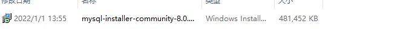

# MeiDuoProject

## 介绍

python项目：美多商城，仅仅用于个人的学习，记录学习利用django开发项目的过程等

## 环境说明

### 软件列表

```
Package                Version
---------------------- -------
asgiref                3.4.1
Deprecated             1.2.13
Django                 3.2.10
django-redis           5.2.0
importlib-metadata     4.8.3
Jinja2                 3.0.3
MarkupSafe             2.0.1
mysql-connector-python 8.0.27
mysqlclient            1.4.6
packaging              21.3
pip                    21.3.1
PyMySQL                1.0.2
pyparsing              3.0.6
pytz                   2021.3
redis                  4.1.0
setuptools             28.8.0
sqlparse               0.4.2
typing_extensions      4.0.1
wheel                  0.37.1
wrapt                  1.13.3
zipp                   3.6.0
```

### 安装软件

```关于安装
pip install django==3.2.10
# 其他可以根据也可以设定指定版本
pip install Jinja2
pip install pymysql
pip insatll django-redis

下载并安装mysql8.x
```

注意事项：

django3.x版本不支持mysql5.x,所以我使用的版本为mysql8.x

### 常用的命令

```
#创建一个项目
python django-admin startproject MeiDuoProject
#启动项目
python manage.py runserver
# 创建子应用
python manage.py startapp users
# 创建迁移文件
python manage.py makemigrations
# 执行迁移命令
python manage.py migrate
```

## 开发日志

### 2022/1/1: 安装mysql8.x

1、mysql8.x的安装包放在doc/soft文件夹下



2、安装为mysql8.x之后，执行python manage.py migrate没有出错，执行产生的效果图如下：


### 2022/1/2:刷新浏览器的方式，查看post请求的内容，简单的正则表达式的使用

#### 1、刷新浏览器两种方式：

* f5刷新：部分加载数据
* shift+f5 刷新：会重新加载所有数据

#### 2、关于如何获取到post请求的内容：

* 先通过print方法打印request.Post中的内容进行查看相关内容
* 通过value = request.Post.get('key')形式获取相应的字段

#### 3、关于正则表达式

* 引入正则表达式模块：import re
* re.match(r'^[a-zA-Z0-9]{5,50}$')的形式

### 2022/1/4:记录正则表达式的错误书写、利用axios向服务端发送get请求(捕获异常、处理函数回调)、图形验证码的使用

#### 1、解决之前因为正则表达式写的不规范导致错误，我将{5,20}写成了{5-20}导致正则匹配错误

#### 2、利用axios向服务端发送get请求判断用户名是否存在

```javascript
 //axios.get('url','请求头').then().catch()
let url = '/usernames/'+this.username+'/count/';
axios.get(url,{
    responseType:'json'
})
    .then(resp =>{
    if(resp.data.count ==1){
        this.error_name_message = '用户名已存在';
        this.error_name = true;
    }else{
        this.error_name = false;
    }
})
    .catch(error=>{
    this.error_name_message = '未知错误或者响应';
    this.error_name = true;
})
```

#### 3、验证码逻辑分析


* 准备captcha扩展包，用于存储图形验证码

  

* 准备redis数据库，存储图形验证码：redis 2号库，在setting文件夹下的dev.py添加redis设置信息

  ```python
  # 配置redis数据库 https://django-redis-chs.readthedocs.io/zh_CN/latest/
  CACHES = {
      # 默认
      "default": {
          "BACKEND": "django_redis.cache.RedisCache",
          "LOCATION": "redis://127.0.0.1:6379/0",
          "OPTIONS": {
              "CLIENT_CLASS": "django_redis.client.DefaultClient",
          }
      },
      # session
      "session": {
          "BACKEND": "django_redis.cache.RedisCache",
          "LOCATION": "redis://127.0.0.1:6379/1",
          "OPTIONS": {
              "CLIENT_CLASS": "django_redis.client.DefaultClient",
          }
      },
      # virify_code
      "virify_code":{
          # 验证码
          "BACKEND": "django_redis.cache.RedisCache",
          "LOCATION": "redis://127.0.0.1:6379/2",
          "OPTIONS": {
              "CLIENT_CLASS": "django_redis.client.DefaultClient",
          }
      },
  }
  ```

* 图形验证码后端逻辑实现

  1、创建子应用验证码:verifications

  2、在工程文件夹下的urls.py文件中设置路由信息

  ```python
   url(r'',include(('verifications.urls','verifications'),namespace='verifications')),
  ```

  在app/verifications文件下新建urls.py文件，设置验证码的路由信息

  ```
  from django.conf.urls import url
  from . import  views
  
  urlpatterns = [
      url(r'^image_codes/(?P<uuid>[\w-]+)/$',views.ImageCodeView.as_view())
  ]
  ```

  在app/verifications文件夹下的models.py创建ImageCodeView的视图：

  ```python
  from django.views import View
  class ImageCodeView(View):
      pass
  ```

### 2022/1/5:图形验证码的后端逻辑和前端逻辑的具体实现，

后端简单逻辑：将captcha文件夹放入到app/verifications/libs文件夹下,利用captcha生成验证码的图像，利用redis存储创建的图形验证码，设置超时时间

```python
from django.views import View

from django_redis import get_redis_connection
from django import http
from verifications.libs.captcha.captcha import captcha

# 在此处创建你的视图
class ImageCodeView(View):
    def get(self,request,uuid):
        # 接收和校验参数
        # 生成图形验证码
        text,image = captcha.generate_captcha()
        print('text:',text,'image:',image)
        # 保存图形验证码
        redis_conn = get_redis_connection('virify_code')
        #redis_conn.setex('key','expires','value')
        redis_conn.setex('img_%s'%uuid,300,text)

        return http.HttpResponse(image,content_type='image/jepg')
```

前端简单逻辑：register.html中，引入common.js，用来调用生成uuid的相关函数；绑定变量image_code_url 和设置点击图片切换函数generate_image_code


register.js中,绑定变量


生成uuid，


### 2022/1/7:首页跳转登录界面和登录相关逻辑验证

* 首页跳转到注册页面

* 点击登录按钮后，首页跳转到登录页面，登录之后跳转到首页
* 登录相关逻辑验证

### 2022/1/8:跳转到用户中心

* 实现了点击用户中心，并跳转到用户中心的功能，如果没有登录则跳转到登录页面，登录成功后再跳转回来
* 关于封装自定义登录类等等

### 2022/1/27:验证邮箱功能实现

#### 用户模型类补充email_active字段

1、添加邮箱验证的状态email_active


2、执行如下操作更新表字段

```python
# 创建迁移文件
python manage.py makemigrations
# 执行迁移命令
python manage.py migrate
```

3、产生的结果


#### 查询并渲染用户基本信息

1、在UserInfoView中处理get请求，设置context数据：包括用户名，手机号，邮箱，邮箱激活状态


2、页面上接收这些数据，并设置到绑定到vue的对象中


3、展示用户的信息等


#### 修改用户绑定的邮箱:接口的定义

#####  1、crf认证

```
"x-csrftoken":getcookie('x-csrftoken')
```

##### 2、接口设计和定义

###### 在users子应用下的views.py中定义EmailView类，定义put接口


###### 在user子应用下的urls.py中定义范文的路由关系


## 问题日志

由于过程中经常遇到各种奇葩问题，所以特此记录。

```
关于gitee上限制大文件：
问题：
由于我要把mysql的安装包上传到gitee上，所以我在本地提交了安装包，但是推送到远端，即gitee上时候，由于文件太大无法推送。
解决方法：
想要再次推送删除掉此安装包(大文件)，从远端克隆一份代码(newcode)，将之前那份代码(oldcode)的除去.git文件夹全部文件到从远端克隆的文件夹(newcode)中,替换相应内容，再提交即可。
```

```
关于正则使用错误：
url(r'^usernames/(?P<username>[a-zA-Z0-9_-]{5-20})/count/$',views.UsernameCountView.as_view())

    url(r'^usernames/(?P<username>[a-zA-Z0-9_-]{5,20})/count/$',views.UsernameCountView.as_view()),

由于我将{5,20}写成了{5-20}导致正则表达式一直匹配不上
```


## 一些发现

pycharm会在此处显示你所有安装的软件包，和所用的python解释器的版本信息


关于使用redis-client的一些小命令：

```shell
select 2 //切换到2号仓库
keys *   //显示当前仓库中的所有key
```

